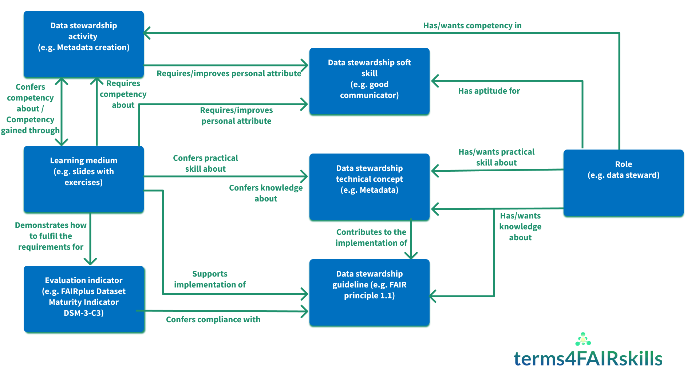

# terms4FAIRskills (T4FS)

More information can be found at http://obofoundry.org/ontology/t4fs

Building a terminology for the skills necessary to make data FAIR and to keep it FAIR. It is now an official OBO Foundry ontology.

The terms4FAIRskills project aims to create a formalised terminology that describes the competencies, skills and knowledge associated with making and keeping data FAIR.

This terminology applies to a variety of use cases, including:
- To assist with the creation and assessment of stewardship curricula;
- To facilitate the annotation, discovery and evaluation of FAIR-enabling materials (e.g. training) and resources;
- To enable the formalisation of job descriptions and CVs with recognised, structured competencies.

The completed terminology is of use to trainers who teach FAIR data skills, researchers who wish to identify skill gaps in their teams and managers who need to recruit individuals to relevant roles.

This repository is used to store the OWL version of the terminology, plus related files.

In July 2020, we received notification of our successful application for EOSC co-creation funding to continue this work.

Thanks to our successful EOSC co-creation proposal, we continued to develop the Terms4FAIRskills (T4FS) using two real-life use cases - the CODATA/RDA Summer Schools and the ELIXIR Training Platform Training and Events Portal (TeSS). Through a number of workshops and hackathons, we iteratively annotated a large number of training materials using the Semaphora annotation tool.

Our report on this work can be found on Zenodo at the following DOI: [10.5281/zenodo.4705219](https://doi.org/10.5281/zenodo.4705219).

We continue to develop terms4FAIRskills and our latest terminology will always be found here. New term requests and queries can be posted on our issue tracker.

For more information on any of the technical aspects of this work, please contact Peter McQuilton or Allyson Lister.

## Views on the Ontology

We currently produce two primary views of this ontology: a complete ontology intended for expert consumption, and fully adhering to the OBO Foundry principles, and a community view that has been simplified for general usage. Please see further details of these in the next sections, which cover release versions and alternative artefacts.

On top of this, we also provide a number of ways to look at and use the ontology. The one that best suits you depends on your needs and your knowledge of ontologies.

1. _Are you new to ontologies?_ Try our [Google spreadsheet](https://docs.google.com/spreadsheets/d/1pu9o8oiP1hwnyQk1tv_8cdoe07GngINRD5pGz04m4Zo/edit?usp=sharing): This is actually our "master" version of the ontology; we use the [ontology development kit](https://github.com/INCATools/ontology-development-kit) and [ROBOT](http://robot.obolibrary.org/) to convert this spreadsheet into OWL. If you like spreadsheets, and you're just looking for terms to use for tagging, then this might be your best bet. The sheet titled "Index" has a simple list of IRIs and labels for each tag. If you are also interested in definitions, please see the sheet titled "t4fs"; this has all the axioms and properties for each of the terms listed in "index". There's a lot of dense information here (and it is very hard to work out the relationships and hierarchies), so please read on if this isn't right for you.
2. _Have some experience with ontologies, or want to review our hierarchy?_ Take a look at our [OBO Foundry t4fs page](https://obofoundry.org/ontology/t4fs), and you can see links to a variety of ontology browsers, including [Ontobee](https://ontobee.org/browser/index.php?o=t4fs) and [OLS](http://www.ebi.ac.uk/ols/ontologies/t4fs). Please note that these browsers utilise our full OBO Foundry hierarchy, which is more complex to view initially as it contains all of the BFO/IAO terms required to place t4fs within the OBO Foundry family. To help with that, please see our current diagram for our ontology model (below), as this provides the relationships among all of our top-level t4fs terms without the BFO/IAO hierarchies.
3. _Are you knowledgeable about ontologies, or just curious?_ Then, as stated below, you can download the ontology in a variety of formats as outlined below (obo, owl and json).

We've drawn this diagram of all upper-level t4fs terms and the relationships they have to each other, in order to provide an overview of how we think about and structure the ontology.

## Versions

### Stable release versions

The latest version of the ontology can always be found at:

http://purl.obolibrary.org/obo/t4fs.owl

### Alternative Artefacts

In addition to the stable release version listed above, we have a variety of different ways in which you can view T4FS. All artefacts other than `community` are as defined https://github.com/INCATools/ontology-development-kit/blob/master/docs/ReleaseArtefacts.md:

* base
* simple
* full
* community: this is a version of t4fs without the upper-level BFO terms, giving our those in our community not familiar with ULOs a view that they are used to.

### Alternative formats

We produce all ontology artefacts in the following formats:
* OWL
* OBO
* JSON

### Editors' version

T4FS uses templates to edit the ontology. This means that you should not edit any of the OWL files that you see in this repository. Instead, please see our [Contributing README](CONTRIBUTING.md) and our [Templates README](src/templates/README.md) for more details.

## Deprecation of terms

Find out more about our [deprecation policy](src/ontology/DEPRECATION.md).

## Contact

Please use this GitHub repository's [Issue tracker](https://github.com/terms4FAIRskills/FAIRterminology/issues) to request new terms/classes or report errors or specific concerns related to the ontology.

## Acknowledgements

This ontology repository was created using the [Ontology Development Kit (ODK)](https://github.com/INCATools/ontology-development-kit).
